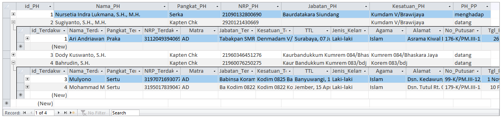

Form Penasihat Hukum (PH) adalah form untuk menambah, mengubah, atau menghapus data Penasihat Hukum. Form ini masih memiliki struktur atau tampilan mirip dengan form Panitera Pengganti atau Oditur Militer, namun sedikit lebih lengkap karena menyesuaikan dengan jabatan dan kesatuan yang bersangkutan.

### Input Data Penasihat Hukum

| Input     | Keterangan    |
| ------    | -----------   |
| ID PH     | Menu navigasi untuk berpindah antar Penasihat Hukum |
| Nama PH   | Tulis nama PH lengkap dengan gelar (jika ada) |
| Pangkat   | Tulis pangkat dengan `disingkat` (contoh: _Kapten Chk_) |
| NRP       | `16 digit` NRP, dapat berupa simbol atau teks |
| Jabatan   | Tulis jabatan Penasihat Hukum secara lengkap |
| Kesatuan  | Tulis kesatuan Penasihat Hukum secara lengkap |

### Bagian Sub-Form Oditur Militer

Bagian sub-form tidak dapat diubah, ditambah, atau dihapus karena statusnya dikunci (_locked_). Bagian ini hanya berfungsi untuk menampilkan daftar Penasihat Hukum yang sudah tersimpan saja. Untuk melakukan perubahan terhadap data PH yang bersangkutan silahkan gunakan menu navigasi yang sudah tersedia.

Perhatikan pada kolom "**PH_PP**" di sub-form, kolom tersebut akan terisi secara otomatis dimana data diambil dari hasil pengolahan formula khusus (_expression builder_) yang kompleks untuk mengatur sikap Penasihat Hukum (datang/menghadap) terhadap Panitera Pengganti sehingga menjadi salah satu keunggulan aplikasi SIPTERA ini.

Salah satu manfaat lain dari sub-form ini adalah dapat menampilkan siapa saja nama Terdakwa yang terkorelasi dengan Penasihat Hukum yang bersangkutan dengan cara klik tombol (**+**) yang ada pada sisi kiri nama PH. Contoh seperti pada gambar, ada 1 Terdakwa yakni Ari Andriawan yang Penasihat Hukumnya adalah Kapten Chk Sugiyanto. Begitu seterusnya.

### Tombol Perintah

| Tombol    | Keterangan    |
| ------    | -----------   |
| Tambah    | Menambahkan data Penasihat Hukum |
| Batal     | Membatalkan perubahan yang terjadi |
| Hapus     | `Menghapus data PH secara keseluruhan` |
| Simpan    | Menyimpan perubahan yang terjadi |
| Tutup     | Menutup form Penasihat Hukum |

{}
Hati-hati dalam memilih tombol yang di-klik karena segala perubahan yang terjadi tidak dapat dikembalikan
{}

{}
Untuk menambahkan data Penasihat hukum yang baru Anda bisa klik pada tombol navigasi _right-arrow_ atau langsung klik tombol "**Tambah**"
{}
