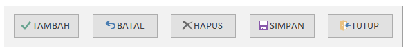

Sesuai namanya, Form Panitera Pengganti adalah form untuk menambah, mengubah, atau menghapus data Panitera Pengganti. Jika dibandingkan dengan form Terdakwa, form ini terlihat lebih sederhana dengan ciri khas utama memiliki sub-form yang menampilkan daftar Panitera Pengganti yang sudah tersimpan dalam database.

### Input Panitera Pengganti

| Input     | Keterangan    |
| ------    | -----------   |
| ID PP     | Menu navigasi untuk berpindah antar Panitera Pengganti |
| Nama PP   | Nama Panitera Pengganti lengkap dengan gelar (jika ada) |
| Pangkat   | Tulis pangkat secara lengkap (contoh: Pembantu Letnan Satu) |
| NRP       | `16 digit` NRP, dapat berupa simbol atau teks |

### Bagian Sub-Form Panitera Pengganti

Bagian sub-form tidak dapat diubah, ditambah, atau dihapus karena statusnya dikunci (_locked_). Bagian ini hanya berfungsi untuk menampilkan daftar Panitera Pengganti yang sudah tersimpan saja. Untuk melakukan perubahan terhadap data Panitera Pengganti yang bersangkutan silahkan gunakan menu navigasi yang sudah tersedia.

Salah satu manfaat lain dari sub-form ini adalah dapat menampilkan siapa saja nama Terdakwa yang terkorelasi dengan Panitera Pengganti yang bersangkutan dengan cara klik tombol (**+**) yang ada pada sisi kiri nama PP. Contoh seperti pada gambar, ada 2 Terdakwa yakni Ari Andriawan dan Wawan Triono yang PP-nya adalah Peltu Rudianto. Begitu seterusnya.

### Tombol Perintah

| Tombol    | Keterangan    |
| ------    | -----------   |
| Tambah    | Menambahkan data Panitera Pengganti |
| Batal     | Membatalkan perubahan yang terjadi |
| Hapus     | `Menghapus data Panitera Pengganti secara keseluruhan` |
| Simpan    | Menyimpan perubahan yang terjadi |
| Tutup     | Menutup form Panitera Pengganti |

{}
Hati-hati dalam memilih tombol yang di-klik karena segala perubahan yang terjadi tidak dapat dikembalikan
{}

{}
Untuk menambahkan data Panitera Pengganti yang baru Anda bisa klik pada tombol navigasi _right-arrow_ atau langsung klik tombol "**Tambah**"
{}
