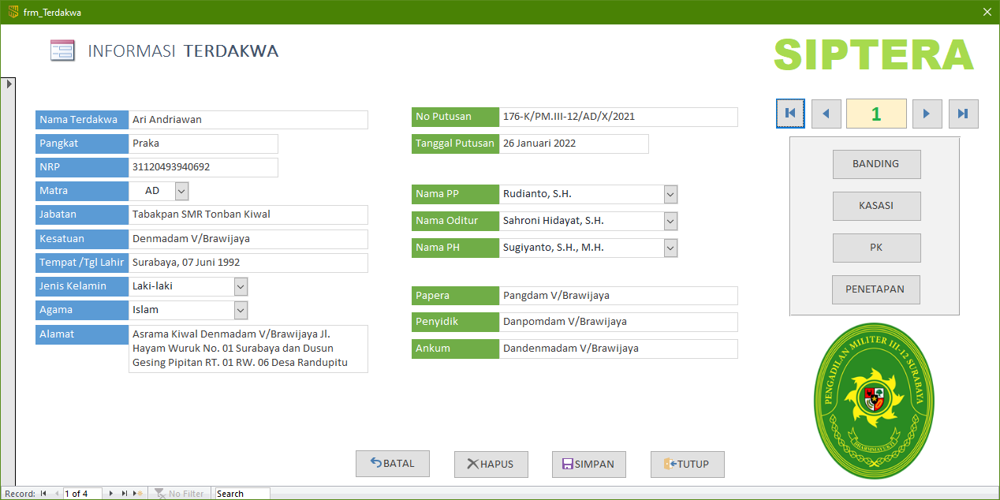
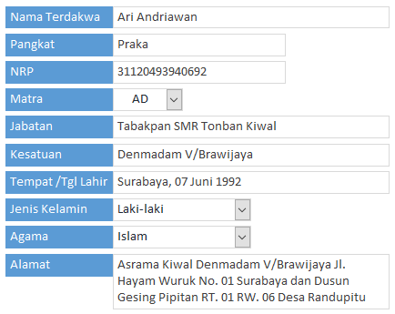
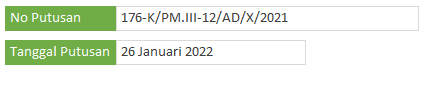
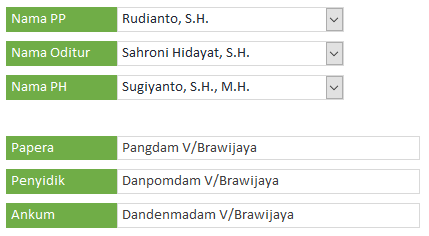
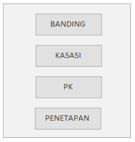
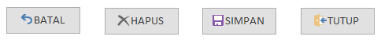

Form Terdakwa adalah form paling penting dalam aplikasi SIPTERA karena dari form inilah aplikasi SIPTERA dapat terkoneksi ke seluruh bagian database lainnya. Adapun bagian-bagian dari form Terdakwa ini antara lain :

### Bagian Terdakwa

| Input     | Keterangan    |
| ------    | -----------   |
| Nama Terdakwa     | Isi nama Terdakwa lengkap dengan gelar (jika ada) |
| Pangkat           | Tulis pangkat terdakwa dalam bentuk singkatan (`Prada, Sertu, Pelda, dll`) |
| NRP               | `16 digit` NRP, dapat berupa simbol atau teks |
| Matra             | Pilih salah satu dari pilihan yang tersedia (`AD/AL/AU`) |
| Jabatan           | Tulis jabatan Terdakwa secara lengkap |
| Kesatuan          | Tulis kesatuan Terdakwa secara lengkap |
| Tempat/Tgl Lahir  | Isi dengan format [`kota, 01 januari 1990`] |
| Jenis Kelamin     | Pilih '`Laki-laki`' atau '`Perempuan`' |
| Agama             | Pilih satu dari 6 pilihan agama yang tersedia |
| Alamat            | Isi dengan alamat lengkap Terdakwa (_max 255 char_) |

### Bagian Putusan

| Input     | Keterangan    |
| ------    | -----------   |
| No Putusan    | Isi dengan `nomor Putusan tingkat pertama` |
| Tgl Putusan   | Tulis `tanggal Putusan tingkat pertama` |

### Bagian Pihak-pihak

| Input     | Keterangan    |
| ------    | -----------   |
| Nama PP       | Pilih nama Panitera Pengganti |
| Nama Oditur   | Pilih nama Oditur Militer |
| Nama PH       | Pilih nama Penasihat Hukum |
| Papera        | Tulis nama Perwira Penyerah Perkara |
| Penyidik      | Tulis nama Penyidik |
| Ankum         | Tulis nama Atasan yang berhak menghukum |

### Bagian Navigasi

Pada bagian ini Anda dapat berpindah antara Terdakwa satu dengan yang lain. Apabila bertanda `(New)` artinya data Terdakwa belum ada dan siap diisi yang baru.

### Tombol Upaya Hukum

Pada bagian ini Anda dapa memilih jenis upaya hukum terhadap Terdakwa yang bersangkutan baik Banding, Kasasi, mauun PK. Form hanya dapat dipilih 1 (satu) kali, dengan kata lain Anda tidak dapat membuka form **Kasasi** bersamaan dengan form **Banding**, dan seterusnya.

### Tombol Perintah

| Tombol    | Keterangan    |
| ------    | -----------   |
| Batal     | Membatalkan perubahan yang terjadi |
| Hapus     | `Menghapus data Terdakwa secara keseluruhan` |
| Simpan    | Menyimpan perubahan yang terjadi |
| Tutup     | Menutup form Terdakwa |

{}
Hati-hati dalam memilih tombol yang di-klik karena segala perubahan yang terjadi tidak dapat dikembalikan
{}
