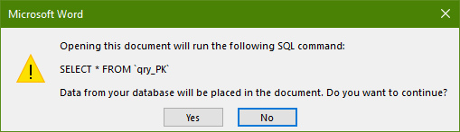

Sebelum memulai proses instalasi dan integrasi aplikasi SIPTERA, siapkan aplikasi SIPTERA dan dokumen template yang sudah disiapkan sebelumnya.

{}
Pastikan komputer yang akan dipasang telah memenuhi standar spesifikasi minimum yang disarankan.
{}

{}
File instalasi SIPTERA bisa anda cari di **Server/Tera 62**
{}

Copy file aplikasi (SIPTERA.accdb) dan 9 (sembilan) dokumen template ke dalam folder local di komputer anda, misalnya di “**Documents**”.


### Memulai Proses Mail Merge

Buka satu-per-satu dokumen template yang sudah di-_copy_. Sebagai contoh, saya membuka file “**BERKAS BANDING TERDAKWA.docx**” berikut ini :



Klik pada tombol "**Yes**" untuk mengijinkan dokumen membuat koneksi dengan database. Kemudian pilih menu `Mailings - Start Mail Merge - Step-by-Step Mail Merge Wizard` seperti yang tertera pada gambar berikut ini :


Pilih menu `Select a different list` kemudian pada kotak dialog yang muncul cari lokasi/folder SIPTERA dan pilih database **SIPTERA.accdb** lalu klik "**Open**"


### Memilih Query Database

Akan muncul kotak dialog untuk memilih tabel mana yang ditampilkan dari database. Pilihlah sesuai kebutuhan, dalam kasus ini saya akan membuka query "**qry_Banding**" lalu klik tombol OK.


{}
Penting! Disinilah kunci untuk memilih query database sesuai dokumen template. Jika anda membuka berkas kasasi baik versi Terdakwa, Oditur, maupun PH maka pilih **qry_Kasasi**. Begitu juga seterusnya untuk berkas PK dan Penetapan.
{}

### Memilih Nama Terdakwa

Berikutnya akan muncul kotak dialog untuk memilih Terdakwa (_recipient_). Disini anda bisa memilih salah satu Terdakwa dengan cara memberi centang lalu klik tombol OK. Apabila tidak muncul apa-apa, berarti anda belum meng-input Terdakwa bersangkutan melalui aplikasi SIPTERA.


{}
Anda dapat memilih salah satu atau beberapa Terdakwa sekaligus dalam satu waktu. Namun sebaiknya pilih salah satu saja dan hilangkan centang pada Terdakwa lainnya.
{}

Setelah anda klik tombol OK mungkin anda tidak melihat ada perubahan pada dokumen template. Namun anda tak perlu khawatir, pilih menu `Mailings - Preview Results` maka isi dokumen template akan langsung berubah sesuai dengan data Terdakwa yang anda pilih sebelumnya.


### Melakukan Generate Dokumen

Sampai sini anda masih belum dapat mencetak dokumen karena hanya menampilkan pratinjau (_preview_) saja. Untuk dapat menghasilkan (_generate_) dokumen, pilih menu `Mailings - Finish & Merge - Edit Individual Documents`.


Pilih "**Current record**" dan klik tombol OK. Maka akan muncul jendela Microsoft Word baru dengan nama "**Letters1**". Dokumen inilah yang menjadi produk akhir dari aplikasi SIPTERA. Anda bisa menyimpan (_Save As_) dokumen ini ke nama yang dikehendaki. Idealnya, kami menggunakan format baku sebagai berikut :

```Berkas [Banding/Kasasi/PK] [Terdakwa/Oditur/PH] [Nama Terdakwa]```

contoh :

```Berkas Banding Oditur Agus Mulyanto.docx```

{}
Kolom Banding, Kasasi, dan PK adalah jenis upaya hukum yang diajukan. Sedangkan kolom Terdakwa, Oditur, atau PH merujuk pada **siapa yang mengajukan upaya hukum** tersebut.
{}

Sampai disini telah selesai melakukan proses instalasi dan integrasi aplikasi SIPTERA dengan dokumen template dan dapat lanjut ke tahap berikutnya.
