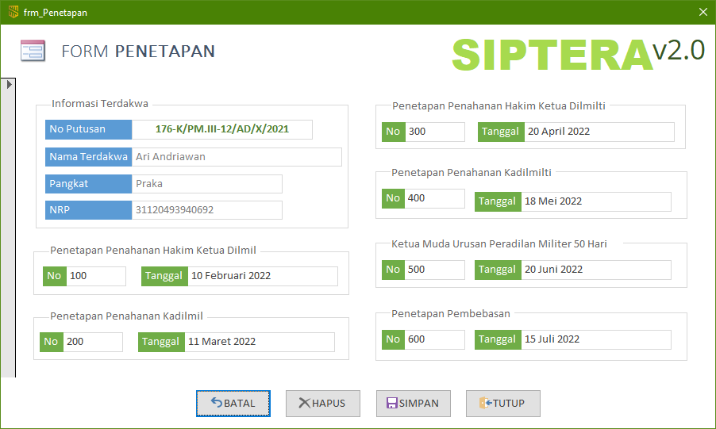

Form Penetapan ini hanya dapat diakses melalui form Terdakwa. Anda **tidak diberikan** hak akses untuk membuka form ini tanpa melewati form Terdakwa terlebih dahulu. Untuk membukanya, silahkan pelajari kembali bagaimana cara mengakses form Penetapan.

{}
Form Penetapan Pembebasan ini terkorelasi atau terhubung sesuai dengan data Terdakwa. Jika Terdakwa A yang terpilih, maka form Penetapan **hanya** akan mengampilkan data penetapan untuk Terdakwa A saja.
{}

### Bagian-bagian Form Penetapan

1. **Penetapan Pembebasan**
    - No: Nomor penetapan ppembebasan dari tahanan
    - Tanggal: Tanggal penetapan pembebasan

{}
Untuk detail teknis pengisian tanggal-tanggal tersebut dapat dikonsultasikan kepada staf Meja 2 Upaya Hukum, Panitera Pengganti, atau Panitera Muda Pidana.
{}
