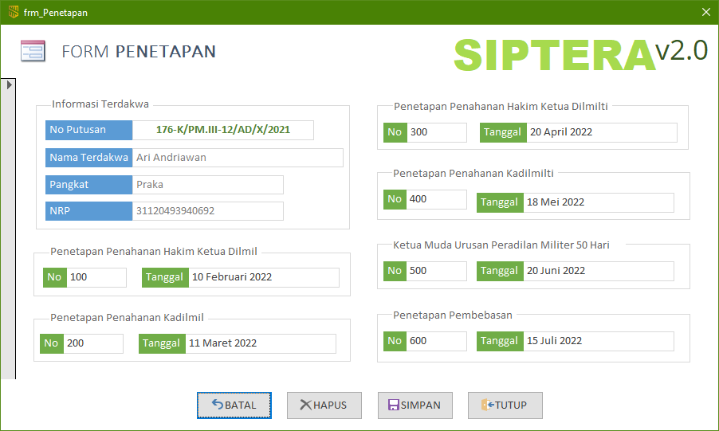

Form Penetapan ini hanya dapat diakses melalui form Terdakwa. Anda **tidak diberikan** hak akses untuk membuka form ini tanpa melewati form Terdakwa terlebih dahulu. Untuk membukanya, silahkan pelajari kembali bagaimana cara mengakses form Penetapan.

{}
Form Penetapan Penahanan ini terkorelasi atau terhubung sesuai dengan data Terdakwa. Jika Terdakwa A yang terpilih, maka form Penetapan **hanya** akan mengampilkan data penetapan untuk Terdakwa A saja.
{}

### Bagian-bagian Form Penetapan

1. **Penetapan Penahanan Hakim Ketua Dilmil**
    - No: Nomor penetapan penahanan
    - Tanggal: Tanggal penetapan penahanan
2. **Penetapan Penahanan Kadilmil**
    - No: Nomor penetapan penahanan
    - Tanggal: Tanggal penetapan penahanan
3. **Penetapan Penahanan Hakim Ketua Dilmilti**
    - No: Nomor penetapan penahanan
    - Tanggal: Tanggal penetapan penahanan
4. **Penetapan Penahanan Kadilmilti**
    - No: Nomor penetapan penahanan
    - Tanggal: Tanggal penetapan penahanan
5. **Penetapan Penahanan dari MA 50 Hari**
    - No: Nomor penetapan penahanan
    - Tanggal: Tanggal penetapan penahanan
6. **Penetapan Penahanan dari MA 60 Hari**
    - No: Nomor penetapan penahanan
    - Tanggal: Tanggal penetapan penahanan
7. **Penetapan Penahanan dari MA 30 Hari**
    - No: Nomor penetapan penahanan
    - Tanggal: Tanggal penetapan penahanan

{}
Untuk detail teknis pengisian tanggal-tanggal tersebut dapat dikonsultasikan kepada staf Meja 2 Upaya Hukum, Panitera Pengganti, atau Panitera Muda Pidana.
{}
