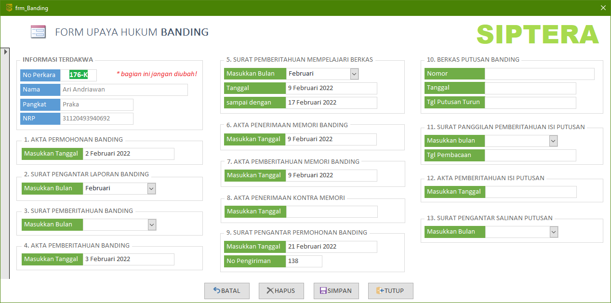

Form Upaya Hukum Banding ini hanya dapat diakses melalui form Terdakwa. Anda **tidak diberikan** hak akses untuk membuka form ini tanpa melewati form Terdakwa terlebih dahulu. Untuk membukanya, silahkan pelajari kembali bagaimana cara mengakses form Banding.

{}
Form upaya hukum Banding ini terkorelasi atau terhubung sesuai dengan data Terdakwa. Jika Terdakwa A mengajukan upaya hukum Banding, maka form Banding **hanya** akan mengampilkan data Banding untuk Terdakwa A saja.
{}

### Bagian-bagian Form Upaya Hukum Banding

1. **Akta Permohonan Banding**
    - Masukkan kapan tanggal Terdakwa mengajukan Banding
2. **Surat Pengantar Laporan Banding**
    - Pilih bulan Terdakwa mengajukan Banding
3. **Surat Pemberitahuan Banding**
    - Masukkan tanggal surat pemberitahuan Banding
4. **Akta Pemberitahuan Banding**
    - Masukkan tanggal akta pemberitahuan Banding
5. **Surat Pemberitahuan Mempelajari Berkas**
    - `Bulan`: Kapan surat pemberitahuan mempelajari berkas dikirim/ diserahkan
    - `Tanggal`: Tanggal awal untuk seluruh pihak mempelajari berkas perkara
    - `Sampai dengan`: Batas akhir seluruh pihak mempelajari berkas perkara
6. **Akta Penerimaan Memori Banding**
    - Masukkan tanggal penerimaan Memori Banding
7. **Akta Pemberitahuan Memori Banding**
    - Masukkan tanggal pemberitahuan Memori Banding kepada pihak lawan
8. **Akta Penerimaan Kontra Memori**
    - Masukkan tanggal penerimaan Kontra Memori Banding
9. **Surat Pengantar Permohonan Banding**
    - `Tanggal`: Kapan surat pengantar permohonan Banding siap dikirim
    - `No Pengiriman`: Nomor surat yang diperoleh dari TAUD
10. **Berkas Putusan Banding**
    - `Nomor`: Nomor Putusan Banding dari Dilmilti
    - `Tanggal`: Tanggal Putusan Banding dari Dilmilti
    - `Tgl Turun`: Tanggal Putusan Banding tersebut turun
11. **Surat Panggilan Pemberitahuan Isi Putusan**
    - `Bulan`: Masukkan bulan untuk pemberitahuan isi Putusan
    - `Tgl Pembacaan`: Kapan isi Putusan tersebut akan dibacakan
12. **Akta Pemberitahuan Isi Putusan**
    - Masukkan tanggal kapan isi Putusan tersebut dibacakan
13. **Surat Pengantar Salinan Putusan**
    - Masukkan bulan kapan salinan Putusan tersebut dikirimkan ke semua pihak

{}
Untuk detail teknis pengisian tanggal-tanggal tersebut dapat dikonsultasikan kepada staf Meja 2 Upaya Hukum, Panitera Pengganti, atau Panitera Muda Pidana.
{}
