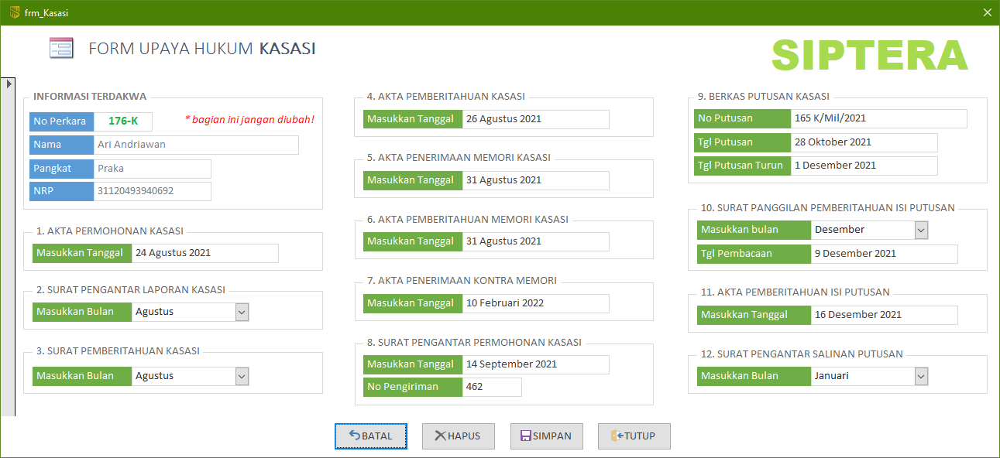
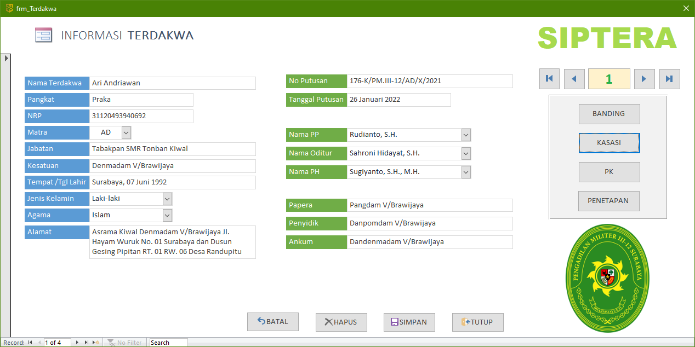

Form Upaya Hukum Kasasi ini hanya dapat diakses melalui form Terdakwa. Anda **tidak diberikan** hak akses untuk membuka form ini tanpa melewati form Terdakwa terlebih dahulu. Untuk membukanya, silahkan pelajari kembali bagaimana [cara mengakses form Kasasi]({}).

Bukalah form Terdakwa yang ingin mengajukan upaya hukum Kasasi. Dalam contoh kasus ini Terdakwa Ari Andriawan hendak melakukan Kasasi, maka klik pada tombol "**Kasasi**" yang tersedia di area panel sebelah kanan. Bagian-bagian form Kasasi dapat dilihat pada tulisan di bawah.

{}
Form upaya hukum Kasasi ini terkorelasi atau terhubung sesuai dengan data Terdakwa. Jika Terdakwa A mengajukan upaya hukum Kasasi, maka form Kasasi **hanya** akan mengampilkan data Kasasi untuk Terdakwa bersangkutan saja.
{}

### Bagian-bagian Form Upaya Hukum Kasasi

1. **Akta Permohonan Kasasi**
    - Masukkan kapan tanggal Terdakwa mengajukan Kasasi
2. **Surat Pengantar Laporan Kasasi**
    - Pilih bulan Terdakwa mengajukan Kasasi
3. **Surat Pemberitahuan Kasasi**
    - Masukkan tanggal surat pemberitahuan Kasasi
4. **Akta Pemberitahuan Kasasi**
    - Masukkan tanggal akta pemberitahuan Kasasi
5. **Akta Penerimaan Memori Kasasi**
    - Masukkan tanggal penerimaan Memori Kasasi
6. **Akta Pemberitahuan Memori Kasasi**
    - Masukkan tanggal pemberitahuan Memori Kasasi kepada pihak lawan
7. **Akta Penerimaan Kontra Memori**
    - Masukkan tanggal penerimaan Kontra Memori Kasasi
8. **Surat Pengantar Permohonan Kasasi**
    - `Tanggal`: Kapan surat pengantar permohonan Kasasi siap dikirim
    - `No Pengiriman`: Nomor surat yang diperoleh dari TAUD
9. **Berkas Putusan Kasasi**
    - `Nomor`: Nomor Putusan Kasasi dari MA
    - `Tanggal`: Tanggal Putusan Kasasi dari MA
    - `Tgl Turun`: Tanggal Putusan Kasasi turun
10. **Surat Panggilan Pemberitahuan Isi Putusan**
    - `Bulan`: Masukkan bulan untuk pemberitahuan isi Putusan
    - `Tgl Pembacaan`: Kapan isi Putusan tersebut akan dibacakan
11. **Akta Pemberitahuan Isi Putusan**
    - Masukkan tanggal kapan isi Putusan tersebut dibacakan
12. **Surat Pengantar Salinan Putusan**
    - Masukkan bulan kapan salinan Putusan tersebut dikirimkan ke semua pihak

{}
Untuk detail teknis pengisian tanggal-tanggal tersebut dapat dikonsultasikan kepada staf Meja 2 Upaya Hukum, Panitera Pengganti, atau Panitera Muda Pidana.
{}
