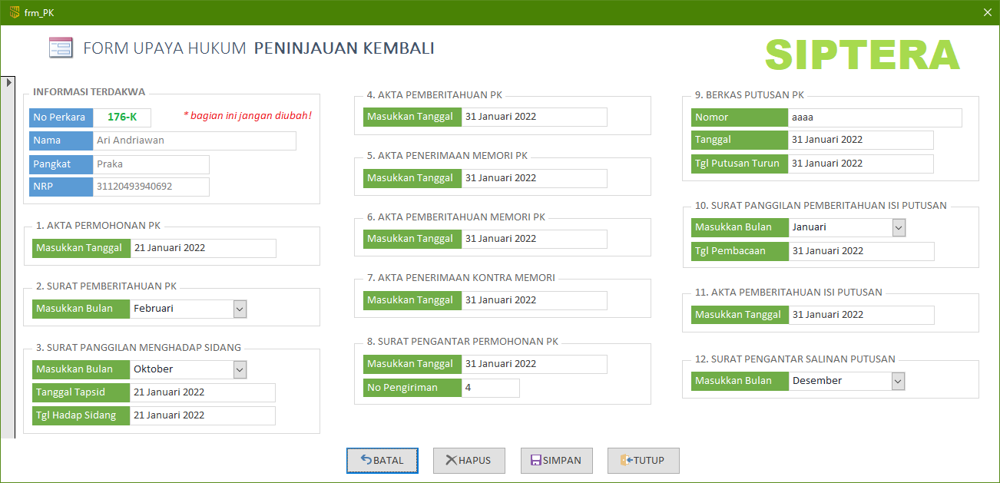

Form Upaya Hukum Peninjauan Kembali (PK) ini hanya dapat diakses melalui form Terdakwa. Anda **tidak diberikan** hak akses untuk membuka form ini tanpa melewati form Terdakwa terlebih dahulu. Untuk membukanya, silahkan pelajari kembali bagaimana cara mengakses form PK.

{}
Form upaya hukum PK terkorelasi atau terhubung sesuai dengan data Terdakwa. Jika Terdakwa A mengajukan upaya hukum PK, maka form PK **hanya** akan mengampilkan data PK untuk Terdakwa bersangkutan saja.
{}

### Bagian-bagian Form Upaya Hukum Peninjauan Kembali

1. **Akta Permohonan PK**
    - Masukkan kapan tanggal Terdakwa mengajukan PK
2. **Surat Pemberitahuan PK**
    - Masukkan tanggal surat pemberitahuan PK
3. **Surat Panggilan Menghadap Sidang**
    - `Bulan`: Masukkan bulan Terdakwa menghadap sidang PK
    - `Tgl Tapsid`: Masukkan tanggal penetapan sidang
    - `Tgl Hadap`: Masukkan kapan Terdakwa menghadap sidang
4. **Akta Pemberitahuan PK**
    - Masukkan tanggal akta pemberitahuan PK
5. **Akta Penerimaan Memori PK**
    - Masukkan tanggal penerimaan Memori PK
6. **Akta Pemberitahuan Memori PK**
    - Masukkan tanggal pemberitahuan Memori PK kepada pihak lawan
7. **Akta Penerimaan Kontra Memori**
    - Masukkan tanggal penerimaan Kontra Memori PK
8. **Surat Pengantar Permohonan PK**
    - `Tanggal`: Kapan surat pengantar permohonan PK siap dikirim
    - `No Pengiriman`: Nomor surat yang diperoleh dari TAUD
9. **Berkas Putusan PK**
    - `Nomor`: Nomor Putusan PK dari MA
    - `Tanggal`: Tanggal Putusan PK dari MA
    - `Tgl Turun`: Tanggal Putusan PK turun
10. **Surat Panggilan Pemberitahuan Isi Putusan**
    - `Bulan`: Masukkan bulan untuk pemberitahuan isi Putusan
    - `Tgl Pembacaan`: Kapan isi Putusan tersebut akan dibacakan
11. **Akta Pemberitahuan Isi Putusan**
    - Masukkan tanggal kapan isi Putusan tersebut dibacakan
12. **Surat Pengantar Salinan Putusan**
    - Masukkan bulan kapan salinan Putusan tersebut dikirimkan ke semua pihak

{}
Untuk detail teknis pengisian tanggal-tanggal tersebut dapat dikonsultasikan kepada staf Meja 2 Upaya Hukum, Panitera Pengganti, atau Panitera Muda Pidana.
{}
